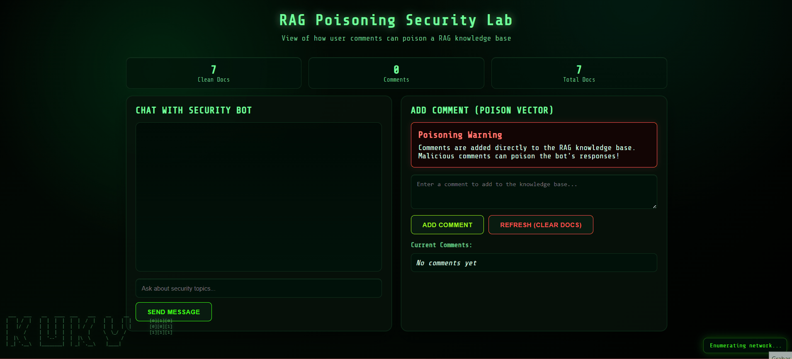

# RAG Poisoning Lab

Hands-on lab showing how malicious inputs can poison a Retrieval-Augmented Generation (RAG) pipeline. Explore attack surfaces, reproduce poisoning, and practice detection and cleanup in a lightweight demo.

## Demo




## Lab Overview
- Flask UI + API to submit questions and inject poisoned comments.
- FAISS vector store with sentence-transformers embeddings for similarity search.
- FLAN-T5-small via Hugging Face pipeline to generate grounded answers.
- Toggle clean baseline docs and rebuild the index to observe drift.
- Endpoints to add/view comments, refresh the store, and inspect stats.

## Requirements
- Python 3.10+
- pip with `python -m venv` (or virtualenv)
- bash (for `run_lab.sh`) or a PowerShell equivalent
- Internet on first run to download the Hugging Face models and embeddings

## Setup
1) Clone the repo and move it to your preferred path. The provided `run_lab.sh` expects `/opt/rag-poisoning-lab`; edit `LAB_DIR` in the script if you use a different location.
2) Create and activate a virtual environment:
```bash
python -m venv .venv
source .venv/bin/activate
# Windows: .\.venv\Scripts\activate
```
3) Install dependencies:
```bash
pip install -r requirements.txt
```

## Run Options
- Using the script (Linux/macOS):
```bash
sudo /bin/bash run_lab.sh
```
The script activates `/opt/rag-poisoning-lab/venv` and executes `app.py`.

- Manually:
```bash
source .venv/bin/activate
python app.py
```
The server listens on `http://localhost:5000`.

## How to Use the Lab
1) Open the UI in your browser.
2) Ask a question to see answers from the clean knowledge base.
3) Add a suspicious comment (poisoned data) and note how the index rebuilds.
4) Re-ask questions to observe response drift caused by the poisoned data.
5) Use **Refresh** to clear injected comments; check **Stats** to inspect document counts.
6) Call `GET /api/comments` to review all stored inputs.

## API Cheatsheet
- POST `/api/chat` with `{ "query": "..." }`
- POST `/api/comment` with `{ "comment": "..." }`
- POST `/api/refresh`
- GET `/api/stats`
- GET `/api/comments`

## Repo Layout
- `app.py`: Flask app wiring FAISS, embeddings, and the LLM.
- `templates/`: Frontend UI.
- `run_lab.sh`: Helper script assuming `/opt/rag-poisoning-lab`.
- `requirements.txt`: Python dependencies.
- `notebooks/`: Experiments and notes.
